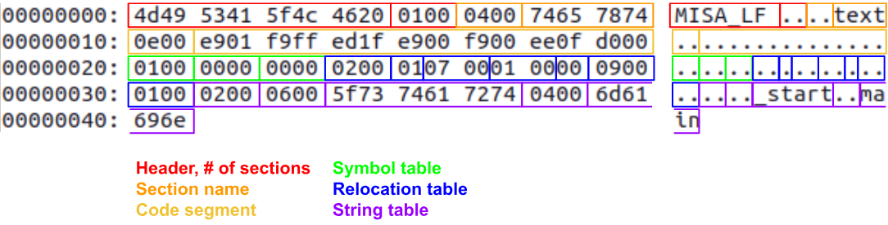

# Toolchain

The MISA project provides a standard toolchain for low-level development of programs on a processor
supporting the full MISA architecture. This includes an assembler, linker, some debug/analysis
tools, and a reference simulator.

This chapter covers the usage and technical details of the toolchain for building programs. That is,
all components of the MISA software package except the functional simulator.

## Assembler

`misa-as` in the reference assembler for the MISA instruction set architecture described in Chapter
1 of this document. It supports all the behavior of the ISA chapter, including the recommended
pseudo instructions and assembler macros.

Using `misa-as` is similar to an abbreviated version of the GNU `as` assemblers and others like it.
For a full description, see the help text at `misa-as --help`. In short, there are two common ways
to use the assembler:

1) Assembling source files to a binary: `misa-as file1.S file2.S ... fileN.S`
2) Assembling source files to object files: `misa-as -a file1.S file2.S ... fileN.S`

The assembler produces object files in a simple format accepted by the MISA linker. By default,
assembling will also invoke the linker to produce a final binary, although this step can be
omitted.

### Assembler Pipeline

The `misa-as` assembler is a wrapper CLI utility for several core binaries including the assembler,
but also the preprocessor and linker.

Assembling with no early-exit flags (e.g. `-p` or `-a`) runs provided files through a multi-step
pipeline:

1) All assembly source files are passed to the MISA preprocessor to resolve any preprocessor
   directives. The pipeline can be stopped after this stage with the `-p` flag.
2) The preprocessed output files are passed to the MISA assembler, which produces object files. The
   pipeline can be stopped after this stage with the `-a` flag.
3) The generated object files, as well as any non-source files originally passed to `misa-as`, are
   passed to the MISA linker to produce the final flat binary.

### Assembler Command Line

`misa-as` classifies its inputs by extension. Source files end with the case-insensitive extensions
`.asm`, `.s`, or `.src`, and are preprocessed and assembled. Any other input is treated as a
pre-assembled object file or library and is passed straight to the linker.

The following flags control how far the pipeline runs and how it behaves:

- `-p` stops after preprocessing and emits the preprocessed source.
- `-a` stops after assembling. Object files are kept, and non-source inputs are ignored. When `-o`
  and more than one source file are given together, the resulting objects are bundled into an
  archive at the output path.
- `-e <extension ...>` enables architecture extensions in the assembler, chosen from `dynamichw`,
  `syscall`, and `privilege`. No extensions are enabled by default.
- `-D <key>=<val>` defines a preprocessor macro before assembling.
- `-o <file>` sets the output path.
- `-l <options>` passes a string of extra options through to the linker.

### Assembler Semantics

#### Instructions

`misa-as` supports the instruction semantics defined in the instruction "Usages" of the ISA chapter.
Opcodes and instruction operands are not comma-separated, and are case-insensitive.

#### Labels

Labels are programmer-defined symbols in assembly source code that are resolved to specific
addresses by the linker. Labels are C-style identifiers (containg the characters '_', a-z, A-Z, and
0-9, but not starting with 0-9) which end with a colon (':').

Label names are global to a binary at the linking stage, and can only be defined once. Assembly
written for the MISA standard library and other system code reserves double-underscore prefix `__`
for "local" labels. The recommended convention local labels in created by compilers and non-library
assembly is a single-underscore prefix `_`. In both cases, local labels should use the name of
their containing function as a discriminant. Compilers are encouraged to support name mangling for
global function labels.

During linking, labels used as instruction operands will be resolved to the address of the
first instruction after the label. For example, consider the following code:

```asm
    SET RA 0
    SET RB 10
loop:
    SET2 RYZ loop
    JMP LESS RA RB
```

In this case, the label `loop` has the relative address in this code of 0x0004, and refers to
the `SET2` instruction.

#### Assembler Directives

`misa-as` supports several assembler directives that change the behavior of the assembler and its
code generation. Directives are C-style reserved identifiers that begin with a period ('.') and
may take one or more operands.

The following directives are currently supported by `misa-as`:

- `.word <Word8>`: Emits the raw byte `<Word8>` in the generated code at the location of the
  directive
- `.array <Word8> [Word8...]`: Emits the raw bytes `<Word8> [Word8...]` in the generated code at the
  location of the directive. Earlier bytes in the array definition will be placed at lower
  addresses. `.array` is equivalent to many consecutive `.word` directives
- `.addr <Label>`: Emits the two-byte address of the label `<Label>` after linking at the location
  of the directive. If the linker places `<Label>` at `<HiByte> - <LoByte>`, this directive is
  equivalent to `.word <LoByte>  .word <HiByte>`.
- `.ascii "<String>"`: Emits the bytes of the string `<String>` using the ASCII encoding at the
  location of the directive. The first letter of the string is placed at a lower address. The
  string is not null-terminated. Escape characters are not supported.
- `.asciiz "<String>"`: Equivalent to `.ascii "<String>"` followed immediately by `.word 0x00`.
  That is, the string is null-terminated with a zero byte at the higher address following the
  last character of the string.
- `.space <Word16>`: Reserves a block of memory of length `<Word16>`. The contents of the memory
  is undefined at runtime. Linker implementations may either fill the memory or simply not place
  other data/text in the reserved area, leaving it uninitialized.
- `.section <String>`: Defines for the linker that all the following code until the next
  section directive should be placed in a section called `<String>`
  
#### Preprocessor Directives

`misa-as` also supports preprocessor directives, but these are not resolved by the assembler
directly. See the section of the MISA preprocessor `misa-pr` for more information on syntax.
Preprocessor directives are resolved by the assembler before the assembly or linking phases.

### MISA Linkable Format

Object files produced by `misa-as` are in the custom `MISA_LF` linkable format, which are binary
files that contain:

- The assembled source code for one or more sections defined in a single assembler translation unit.
- A list of symbols (assembler labels) defined in the translation unit, along with their addresses
  relative to the beginning of the object file's machine code.
- A list of symbols required (not defined) by the translation unit during the linking phase, along
  with the address relative to the beginning of the object file's machine code where the symbol
  is needed.
  
#### Object File Description
  
Binary object files and all fields within them are encoded with little endian byte order. Each
object file contains the following information:

| Length   | Type               | Content                                                                                                           |
|----------|--------------------|-------------------------------------------------------------------------------------------------------------------|
| 8        | String             | The string `MISA_LF␣`, where `M` is the least significant byte and `␣` is the most significant byte.              |
| 2        | Word16             | The number of sections present in the object file.                                                                |
| Variable | [Sec]              | The content of each section, repeated as many times as specified in the length field.                             |
| 2        | Word16             | The number of strings present in the string table.                                                                |
| Variable | [(Word16, String)] | The ordered list of all string identifiers preceeded by their lengths, repeated as specified in the length field. |

: {tbl-colwidths="[10, 25, 65]"}

#### Object File Section Description

Each section contains the following information:

| Length   | Type       | Content                                                                     |
|----------|------------|-----------------------------------------------------------------------------|
| 2        | Word16     | The length in bytes of the section name string field.                       |
| Variable | String     | The name of the section as defined with the `.section` assembler directive. |
| Variable | Code       | The content of the assembled machine code for the specified section.        |
| Variable | SymTable   | The table of symbols defined by the code in the specified section.          |
| Variable | RelocTable | The table of relocations required by the code in the specified section.     |

: {tbl-colwidths="[10, 15, 75]"}

#### Object File Code Description

Each code table contains the following information:

| Length   | Type    | Content                                  |
|----------|---------|------------------------------------------|
| 2        | Word16  | The length in bytes of the machine code. |
| Variable | [Word8] | The machine code.                        |

: {tbl-colwidths="[10, 15, 75]"}

#### Object File Symbol Table Description

Each symbol table contains the following information:

| Length   | Type   | Content                                    |
|----------|--------|--------------------------------------------|
| 2        | Word16 | The number of symbols in the symbol table. |
| Variable | [Sym]  | The list of symbols.                       |

: {tbl-colwidths="[10, 15, 75]"}

Each entry in the symbol table contains the following information:

| Length | Type   | Content                                                                                       |
|--------|--------|-----------------------------------------------------------------------------------------------|
| 2      | Word16 | The address relative to the start of the code table that the symbol points to.                |
| 2      | Word16 | The 0-aligned index into the object file's string table where the symbol's name can be found. |

: {tbl-colwidths="[10, 15, 75]"}

#### Object File Relocation Table Description

Each relocation table contains the following information:

| Length   | Type    | Content                                            |
|----------|---------|----------------------------------------------------|
| 2        | Word16  | The number of relocations in the relocation table. |
| Variable | [Reloc] | The list of relocations.                           |

: {tbl-colwidths="[10, 15, 75]"}

Each entry in the relocation table contains the following information:

| Length | Type   | Content                                                                                                                              |
|--------|--------|--------------------------------------------------------------------------------------------------------------------------------------|
| 1      | Word8  | Whether the byte at the relocation address must be filled with the high (0x01) or low (0x00) half of the relocated symbol's address. |
| 2      | Word16 | The address relative to the start of the code table of the byte that needs to be filled by the linker.                               |
| 2      | Word16 | The 0-aligned index into the object file's string table where the symbol's name can be found.                                        |

: {tbl-colwidths="[10, 15, 75]"}

#### Object File Example

Consider the following code stub that has code, exported symbols, and required relocations:

```asm
    .section text
_start:                   // _start is a symbol
    SET2 RSCRATCH 0x01FF
    WSR SADDR RSCRATCH
    CALL main             // main is a relocation
    HALT RT
```

Assembling this code to an object file with `misa-as -a start.S -o start.o` will produce the
following object code:



## Linker

`misa-ld` is the reference linker for the `MISA_LF` linkable format of object files. It places the
code sections of one or more object files into a flat binary, resolving symbol positions and
applying relocations along the way. Archive files produced by `misa-ar` are recognized by the
case-insensitive `.a` extension. The linker extracts them first and links the object files they
contain.

The linker always emits a flat binary rather than a new object file. The binary spans the entire
64 KiB address space of the MISA architecture, so it can be loaded directly into the memory of a
MISA processor. The output path defaults to `memory.bin` and is set with `-o`.

When `-g <file>` is given, the linker also emits an object file that holds only a symbol table with
the absolute address of every placed symbol. This debug object is meant for tools that resolve
symbol names to addresses, such as the simulator described in Chapter 3.

### Memory Map Files

A memory map file is a small linker script that tells the linker where to place each section in the
address space. Each entry gives an address range and the sections that belong in it. The grammar is:

```
memmap  ::= ("section" number "-" number ":" (section)* ";")+
number  ::= 0x(0-9a-fA-F)+
section ::= (_a-zA-Z)(_a-zA-Z0-9)*
```

A memory map file is selected with `-M <path>`. When none is given, the linker uses the following
default map:

```
section 0x0000 - 0x00FF : direct      ;  // Zero pages
section 0x0100 - 0x01FF :             ;  // Stack
section 0x0200 - 0x7FFF : data bss    ;  // RAM
section 0x8000 - 0xBFFF :             ;  // Memory-mapped IO
section 0xC000 - 0xFFEF : text rodata ;  // Program ROM
section 0xFFF0 - 0xFFFF : vectors     ;  // Vector table
```

## Other Tools

The toolchain includes several smaller tools for preprocessing source, bundling objects, and
inspecting binaries.

### Preprocessor

`misa-pr` is the source-agnostic preprocessor that runs before the assembler. It resolves `#`
directives and emits a file with the directives removed. A file with no directives passes through
unchanged. Preprocessing runs in two passes. Inclusions are resolved first, then macros are expanded
over the combined content from top to bottom.

#### Includes

The `#include` directive pastes the contents of another file in place of the directive:

```
#include "<path>"
```

Inclusions are resolved recursively, so an included file may include further files. The preprocessor
looks for `<path>` first relative to the current directory, then in each directory listed in the
`MISA_PR_INCLUDE_PATH` environment variable. That variable is a colon-separated list of directories,
searched in order.

#### Macros

An object-like macro replaces every later token that matches its name with a body:

```
#macro <name> <body> #endm
```

A function-like macro takes a parenthesized list of space-separated arguments and substitutes them
into its body at each call:

```
#macro <name>(<arg> ...) <body> #endm
```

Such a macro is called as `<name>(<arg> ...)` with space-separated arguments, and is expanded only
when the number of arguments matches the definition. Macros may be redefined, and the most recent
definition above a use takes effect. A macro can also be defined for the whole file on the command
line with `-D <key>=<val>`, which behaves like an object-like macro.

### Archiver

`misa-ar` bundles several `MISA_LF` object files into a single archive, and extracts them again.
Archives are used to distribute libraries of object files that the linker consumes directly. Only
the object file contents are preserved, so other filesystem metadata is not restored on extraction.

`misa-ar` takes one of two mutually exclusive subcommands:

- `misa-ar c <objfile ...> [-o <file>]` creates an archive from the given objects. The output
  defaults to `library.a`.
- `misa-ar x <archive> [-o <dir>]` extracts the objects from an archive into a directory, which
  defaults to the current directory.

The linker and `misa-nm` accept archives directly and extract them on their own.

#### Archive File Description

Archive files use the `MISA_AR` container format. As with the object format, all fields are encoded
with little endian byte order. Each archive contains the following information:

| Length   | Type          | Content                                                                                              |
|----------|---------------|------------------------------------------------------------------------------------------------------|
| 8        | String        | The string `MISA_AR␣`, where `M` is the least significant byte and `␣` is the most significant byte. |
| 2        | Word16        | The number of objects present in the archive.                                                        |
| Variable | [NamedObject] | The named objects, repeated as many times as specified in the count field.                           |

: {tbl-colwidths="[10, 20, 70]"}

Each named object pairs an object file with the name it is restored under:

| Length   | Type   | Content                                                    |
|----------|--------|------------------------------------------------------------|
| 2        | Word16 | The length in bytes of the object name string.             |
| Variable | String | The object file name, used as the file name on extraction. |
| Variable | Object | A full MISA_LF object file, laid out as described above.   |

: {tbl-colwidths="[10, 15, 75]"}

### Name Lister

`misa-nm` lists the symbols in `MISA_LF` object files and `MISA_AR` archives. With no file arguments it
prints nothing. Archives are extracted first, and the symbols of each archived object are listed in
turn.

The listing begins with a `File "<path>"` line, then one `Section <name>:` header for each section
in the object. Within a section, a defined symbol that the object exports is marked `<-`, and a
required symbol that the object imports is marked `->`. Each line shows the symbol or relocation
address within the object in hexadecimal, followed by the symbol name.

A required symbol also carries a relocation marker. `(hi)` means the relocation fills bits 15:8 of
the symbol value, and `(lo)` means it fills bits 7:0. Single-byte relocations default to `(lo)`.

For the object file from the earlier example, `misa-nm start.o` prints:

```
File "start.o"

  Section text:

    <- 0000 _start
    -> 0007 main (hi)
    -> 0009 main (lo)
```

Here `_start` is defined at the start of the code, and the two `main` entries are the high and low
relocation holes left by the `CALL main` expansion.

### Object Dumper

`misa-objdump` disassembles flat binaries and `MISA_LF` object files back into MISA assembly. The file
format is inferred from the `MISA_LF` magic header, and any other file is treated as a flat binary.
The format can be forced with `-f <format>`, either `misa_lf` or `binary`.

Disassembly is requested with one of two flags. `-d` disassembles the sections expected to hold
code, which applies to object files. `-D` disassembles the whole file and is required for a flat
binary, since a flat binary has no section structure. The `--start-address` and `--stop-address`
options restrict the output to a range.

Each disassembled line shows the address, the raw instruction bytes, and the decoded instruction. An
object file carries its own symbol and relocation tables, so labels and relocated immediates appear
directly in its disassembly. For a flat binary, a debug object file passed with `-g <file>` supplies
those same annotations.

Disassembling the earlier object file with `misa-objdump -d start.o` prints:

```
                       .section text
                       _start:
0x0000  E9 01 F9 FF        SET2 RSCRATCH0 RSCRATCH1 0x1FF
0x0004  ED 1F              WSR SADDR RSCRATCH0 RSCRATCH1
0x0006  E9 00 F9 00        SET2 RSCRATCH0 RSCRATCH1 main
0x000A  EE 0F              JAL ALWAYS RSCRATCH0 RSCRATCH1
0x000C  D0 00              HALT RT
```

The `CALL main` pseudo instruction expands into a `SET2` and `JAL` pair, and the unresolved `main`
relocation is shown by name in the `SET2` immediate.
